<!--
  EDIT MAP
  ─ Technology tiers .... stack.json
  ─ TUI layout/content .. scripts/generate-profile.mjs
  ─ Regenerate assets ... node scripts/generate-profile.mjs
  ─ Contact links ....... search: CONNECT

  Local previews and review notes live in .review/ and are gitignored.
-->

  <picture>
    <source media="(max-width: 600px)" srcset="assets/profile-tui-mobile.svg" />
    
  </picture>

<!-- CONNECT -->

  <code>connect:</code>

  
  &nbsp;&nbsp;
  
  &nbsp;&nbsp;
  
  &nbsp;&nbsp;
  
  &nbsp;&nbsp;
  

<!-- /CONNECT -->
